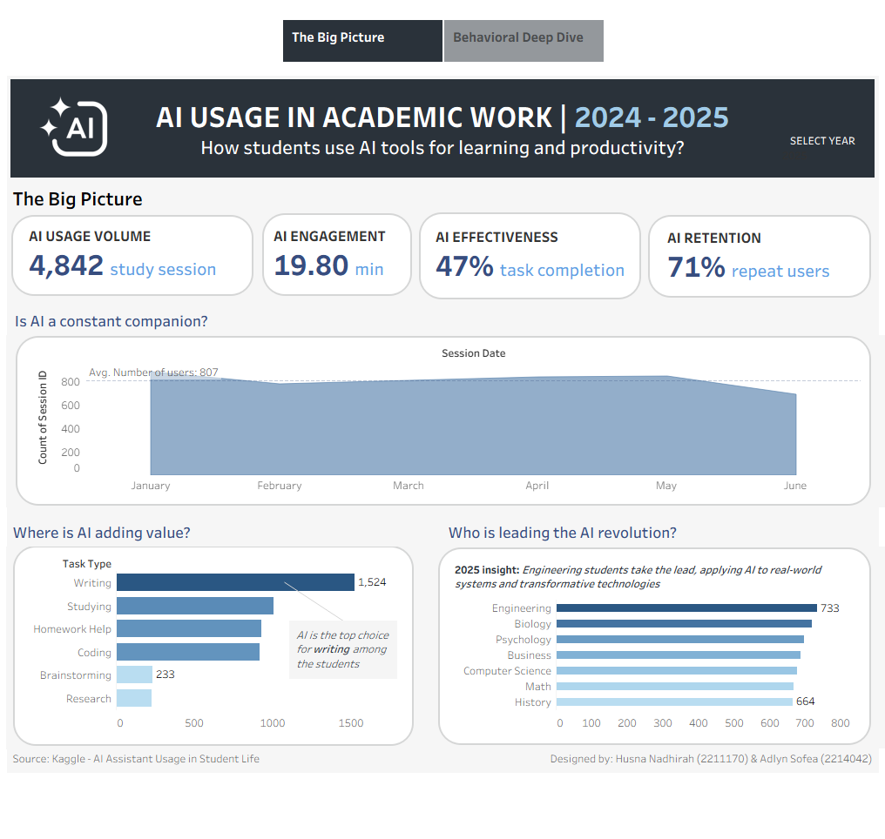
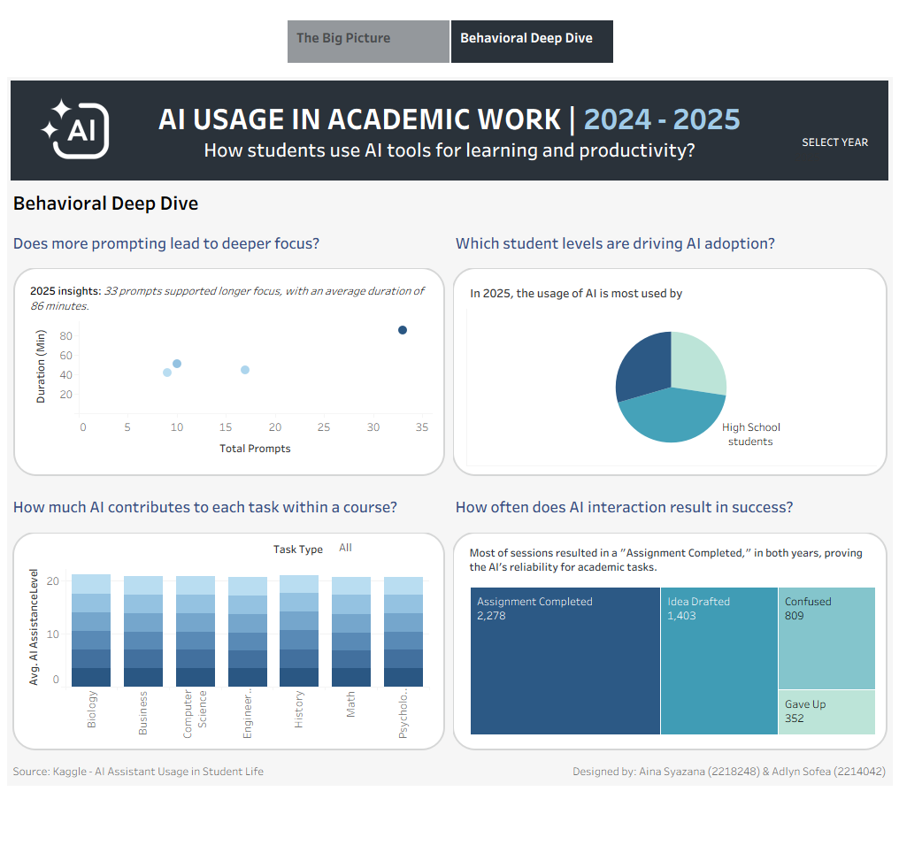

# 📊 AI Usage in Academic Work (2024–2026)

An interactive Tableau dashboard exploring **AI engagement in higher education**, designed to highlight adoption trends, behavioral patterns, and effectiveness with a clean, story‑driven interface.

---

## Overview
This project investigates **AI usage in academic contexts between 2024–2026**, combining a **big picture view** with a **behavioral deep dive**.  
The dashboard was built to answer critical questions about how students and institutions interact with AI tools, and where value is being created.

---

## Key Insights
- **AI Engagement Volume**: How frequently students interact with AI across courses.  
- **Effectiveness & Retention**: Measuring success rates and sustained usage over time.  
- **AI as a Constant Companion?**: Exploring whether AI is embedded into daily academic routines.  
- **Value Creation**: Identifying areas where AI adds the most impact in coursework.  
- **Leadership in Adoption**: Which student levels or groups are driving the AI revolution.  
- **Prompting & Focus**: Does more prompting lead to deeper concentration and better outcomes?  
- **Contribution by Task**: How much AI supports specific academic tasks (research, writing, problem‑solving).  
- **Success Rates**: Frequency of AI interactions resulting in useful outcomes.

---

## Features
- 🔍 **Filter Functionality**: Explore AI usage by student level, course type, and time period.  
- 🌙 **Dark Mode Toggle**: Enhanced accessibility with light/dark mode options.  
- 📈 **Dynamic Visuals**: Clear charts and behavioral breakdowns for intuitive storytelling.  
- 📚 **Story Mode**: Narrative flow combining big picture adoption trends with deep behavioral insights.

---

## Screenshots
### Big Picture View

### Behavioral Deep Dive

---

## Skills Highlighted
- Data Cleaning & Transformation  
- Tableau Storytelling & Dashboard Design  
- Behavioral Analytics & Trend Analysis  
- Business Intelligence & Visualization  
- UI/UX Enhancements (filters, dark mode, story mode)

---

## Live Dashboard
👉 [View on Tableau Public]([https://public.tableau.com/shared/D6PS6ZYQ6?:display_count=n&:origin=viz_share_link])
